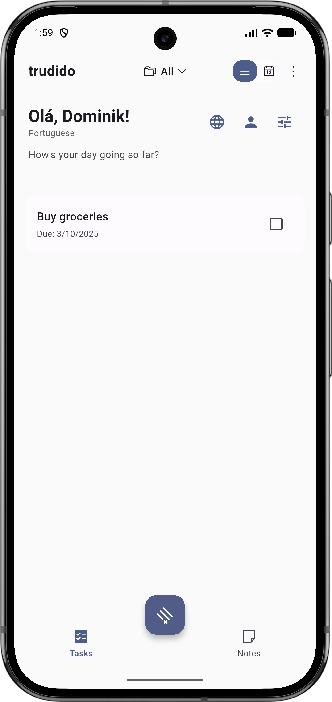
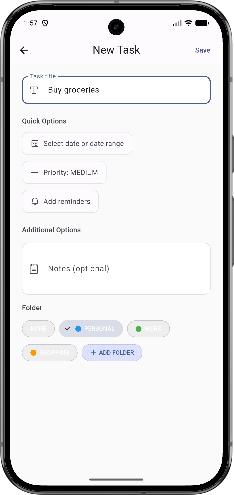
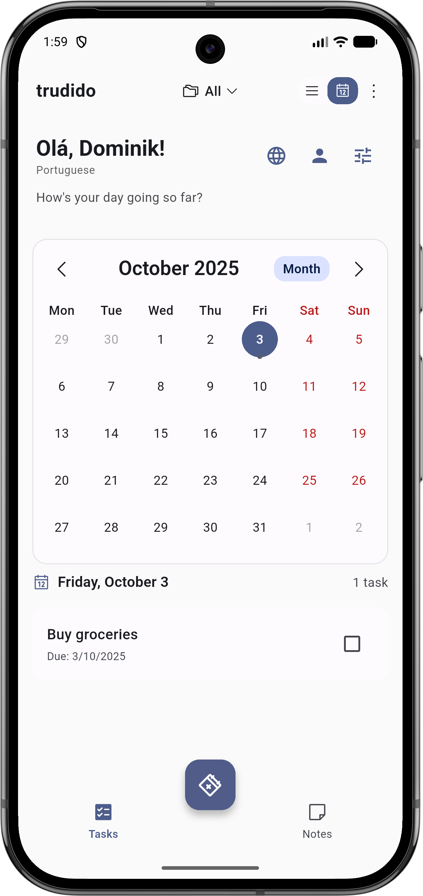
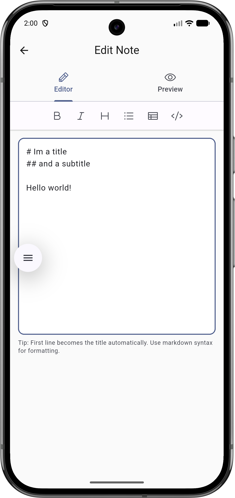
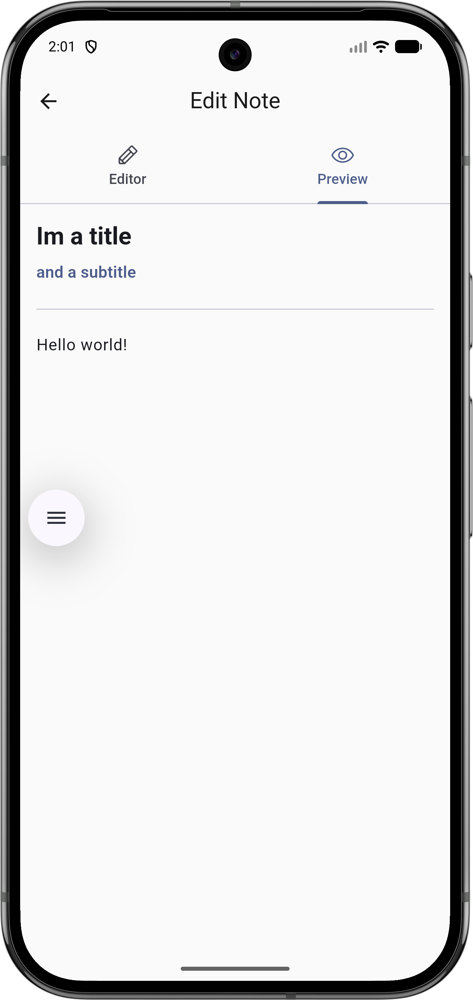
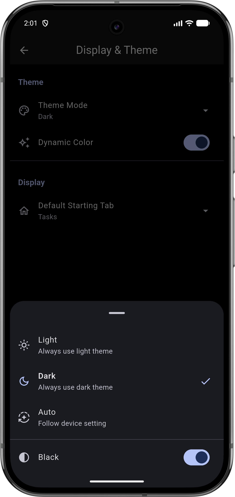
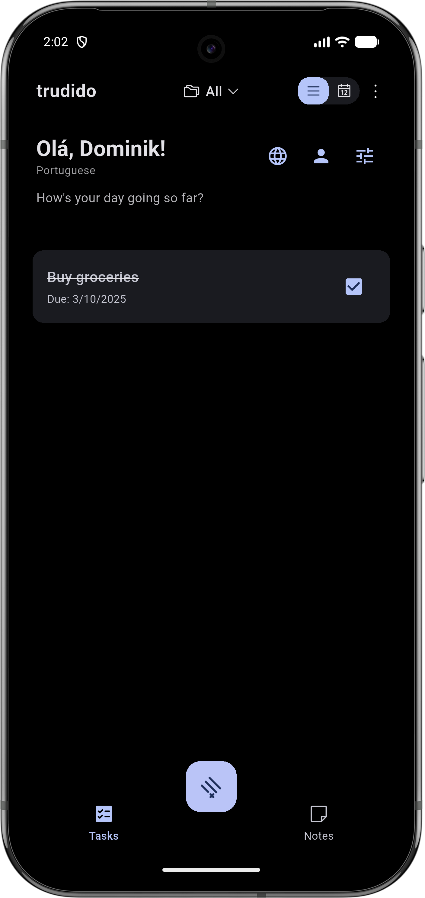

# Trudido — Flutter Todo App

Lightweight, privacy-first todo application built with Flutter.

This repository contains the app source. The public README below gives contributors and users the quick steps to run the app and add screenshots or documentation.

---

## Features

- Task creation, editing and completion
- Categories/folders and templates
- Local persistence (no remote server required)
- Light / Dark theme support with dynamic color schemes
- Notification prompts and system permission helpers

## Screenshots

  
  
  

  
  
  
  
  

</p

