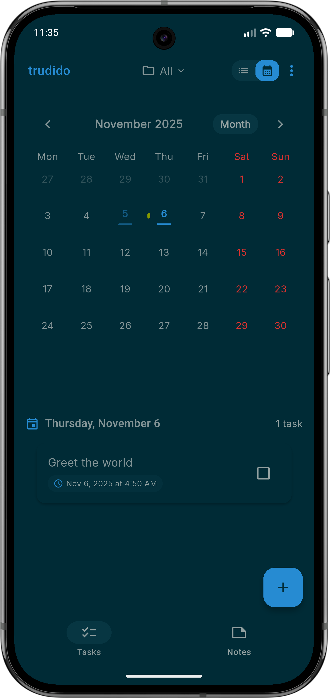
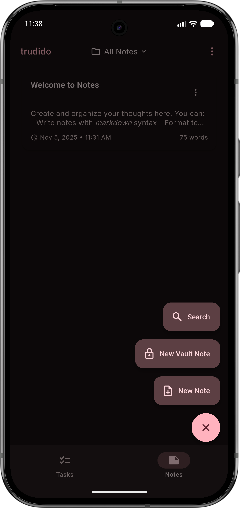

  

<h1 align="center">Simple tasks. Secure notes. Made in Europe.</h1>

  
  
  
  
  

  <table align="center" border="0">
    <tr>
      <td align="center" style="vertical-align: middle;">
        
      </td>
      <td align="center" style="vertical-align: middle;">
        
      </td>
      <td align="center" style="vertical-align: middle;">
        
      </td>
    </tr>
  </table>

  <strong>Love Trudido? Support its development</strong>  
  
  &nbsp;
  

## Official Sources
The links above are the only trusted sources of Trudido. Any other websites or listings are not affiliated with me or this project.

## 📍 Table of Contents
- [📋 Task Management](#-task-management)
- [📝 Notes](#-notes)
- [🔐 Vault (Encrypted Notes)](#-vault-encrypted-notes)
- [🗂️ Folder Templates](#️-folder-templates)
- [💾 Backup & Data Ownership](#-backup--data-ownership)
- [📅 Calendar Sync](#-calendar-sync)
- [🎨 Design & Customization](#-design--customization)
- [🔒 Privacy](#-privacy)
- [📸 Screenshots](#-screenshots)
- [🧩 License](#-license)
- [💬 Contributing](#-contributing)

## 📋 Task Management
- Smart task creation: title, notes, due date & time, and priority
- Organize tasks into folders (with colors/icons)
- Recurring tasks: daily/weekly/monthly + custom patterns (e.g. every 2 weeks, specific weekdays) with optional end date
- Multi-day tasks (start date → due date)
- Reminders with multiple reminder times (native Android scheduling)
- Multiple views: list + calendar (month / 2 weeks / week / day)
- Advanced filtering, sorting, and search
- Quick actions: swipe actions, multi-select, and batch operations
- Progress insights: completion stats + streak tracking
  
## 📝 Notes
- Markdown notes with live preview + formatting helpers
- Rich-text editor (WYSIWYG) with support for media (images / audio / video)
- Pin important notes, move notes between folders, and manage note collections
- Export notes (e.g. PDF / Markdown)

## 🔐 Vault (Encrypted Notes)
- Lock note folders as an AES-256 encrypted Vault
- Secure access with password/PIN and optional biometric unlock
- Vault content stays local and encrypted on-device
  
## 🗂️ Folder Templates
- Built-in templates to instantly create task folders with pre-filled workflows
- Create your own templates (or generate one from an existing folder)
- Template suggestions when creating a new folder
  
## 💾 Backup & Data Ownership
- Export/import full app data (JSON)
- Export everything to a single PDF (tasks + notes)
- Import/export notes as Markdown
- Automatic backups on a schedule (Android) + restore from auto backups
  
## 📅 Calendar Sync
- Optional sync with your device calendars (import and/or export)
- Calendar diagnostics and per-calendar selection
  
## 🎨 Design & Customization
- Material 3 interface
- Dynamic color (Material You, Android 12+)
- Light/Dark modes + custom accent themes
- Compact density + high-contrast option
- UI preferences like swipe behavior, FAB position, and layout tweaks

## 🔒 Privacy
- 100% offline by default — your data stays on your device
- No tracking, ads, or analytics
- Full control over your data with import/export and backups
- Lock the whole app with PIN and optional biometric unlock

### Your tasks and notes stay with you.

## 📸 Screenshots

  
  
  
  
   
  
  
 

## 🧩 License
Licensed under the **GNU General Public License v3.0 (GPL-3.0)**.  
You are free to use, modify, and distribute this software under the same license.  
See the [LICENSE](LICENSE) file for details.

## 💬 Contributing
Pull requests are welcome.  
For major changes, please open an issue first to discuss what you’d like to modify.

