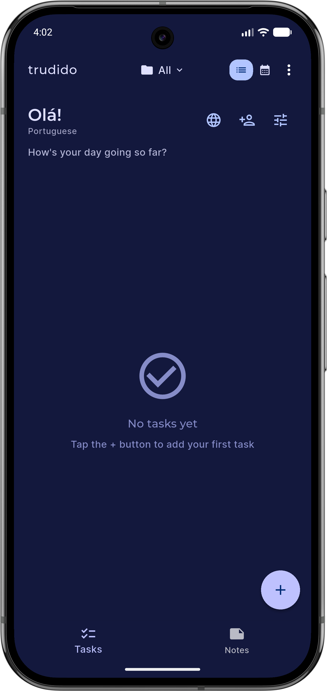
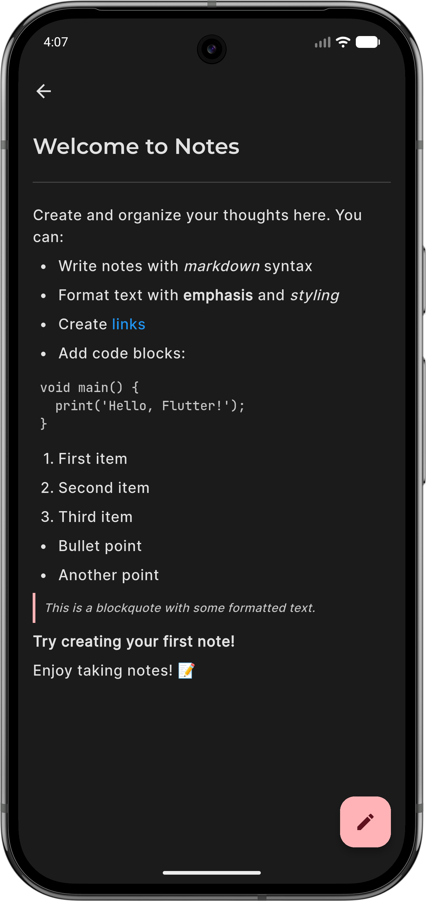
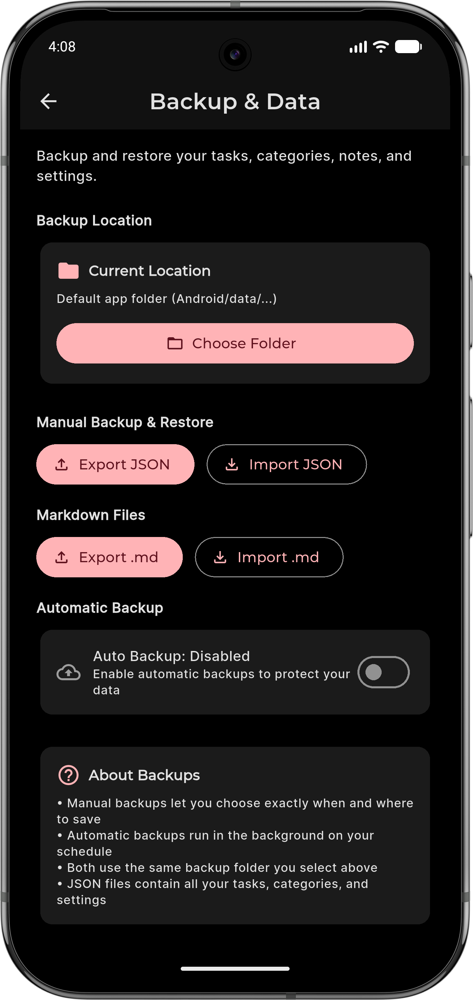
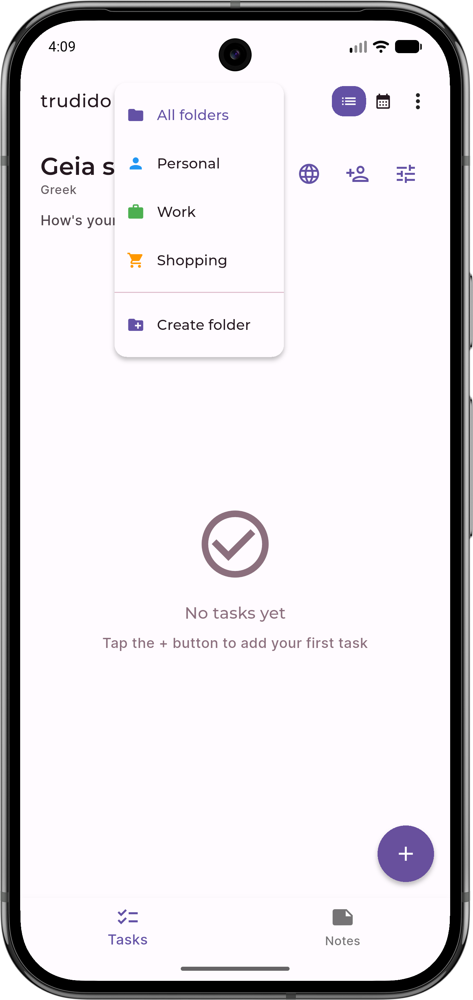

  

  Here you can help me with the translation -->
  

<h1 align="center">Trudido — Minimalist Material You To-Do App</h1>

  A lightweight, privacy-first to-do app built with Flutter and Material You.

---

## ✨ Features

### 📋 Task Management
- Smart creation: titles, notes, due dates, and priorities  
- Organize tasks in folders and categories  
- Multiple views: list and calendar  
- Advanced filtering and sorting  
- Quick actions: swipe to edit/delete, multi-select for batch operations  

### 📝 Notes
- Markdown support with live preview  

### 🎨 Design
- Material 3 interface following Google’s latest guidelines  
- Dynamic color (Material You, Android 12+)  
- Light/Dark modes  
- Custom accent colors when dynamic color is off  
- Responsive layout across devices  

### 🔒 Privacy
- 100 % offline — all data stored locally on your device  
- No tracking, ads, or analytics  
- Import/export functionality for complete data ownership  

---

## 📦 Installation
[⬇️ Download the latest release](https://github.com/dominikmuellr/trudido/releases)  
*(Play Store listing coming soon)*

---

## 🧩 License
Licensed under the **GNU General Public License v3.0 (GPL-3.0)**.  
You are free to use, modify, and distribute this software under the same license.  
See the [LICENSE](LICENSE) file for details.

---

## 💬 Contributing
Pull requests are welcome!  
For major changes, please open an issue first to discuss what you’d like to modify.

---

## 📸 Screenshots

  
  
  
  
</p

